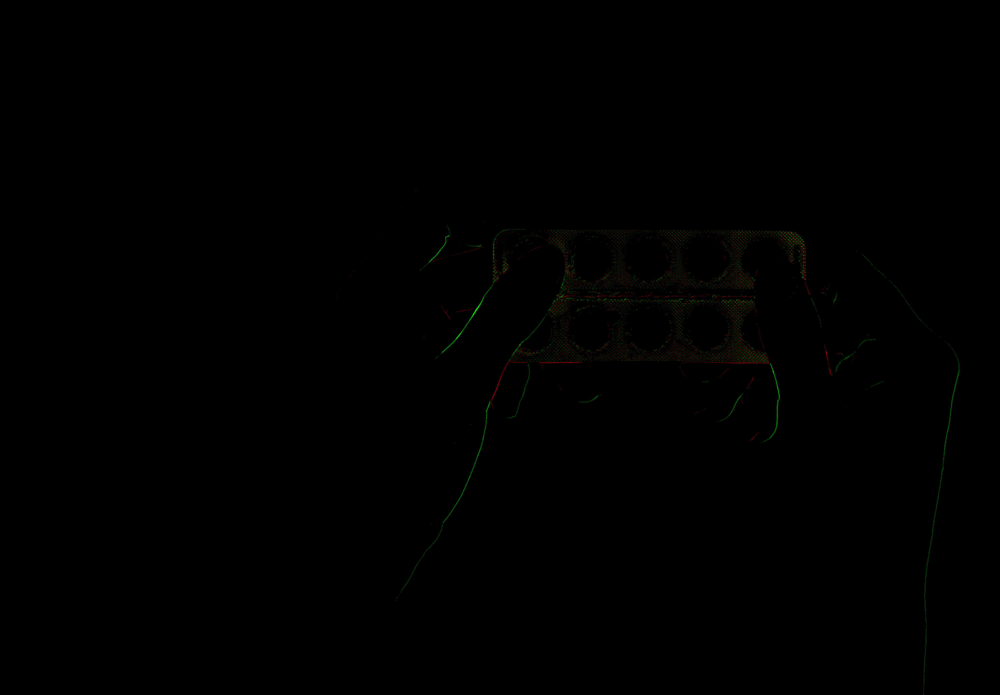
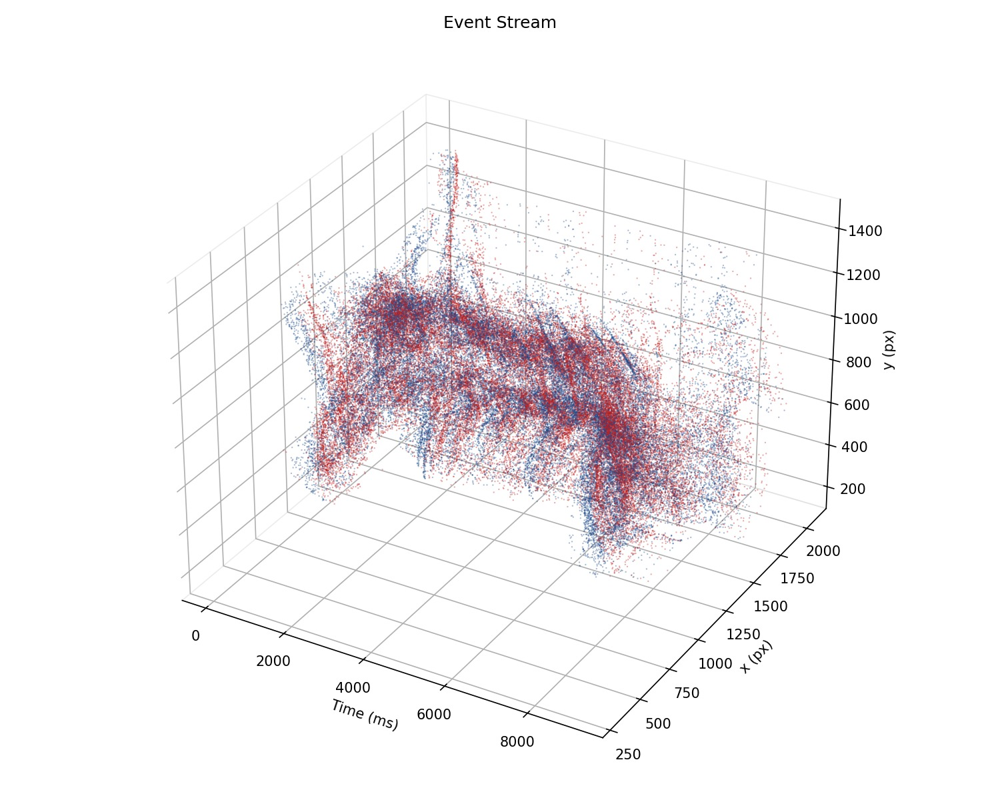

# Event dataset report — `canva`

This folder contains the **results** of the **event pipeline** (`scripts/event_pipeline.py`) applied to the input video below. Synthetic events were generated with **ESIM** (`esim_py`) from grayscale frames and per-frame timestamps.

## Input video

**File:** [`example/canva/drug.mp4`](../../canva/drug.mp4) (relative to repo root: `../../canva/drug.mp4` from this report).

<video src="../../canva/drug.mp4" controls width="720"></video>

*If the player does not appear (e.g. some Markdown previews), open the file link above or play the file locally.*

---

## Results in this folder (visualizations)

### Synthetic event stream (GIF)

Time-sliced 2D accumulation: red = positive polarity, green = negative.



### 3D event stream (image)

**Event stream** plot: horizontal axis = time (ms), other axes = pixel \(x\), \(y\); red = ON (+1), blue = OFF (−1). Subsampled for plotting.



---

## Source (metadata)

| Field | Value |
|--------|--------|
| Video file | `example/canva/drug.mp4` |
| Nominal FPS | 25 |
| Frames used | 229 |
| Clip duration (from events) | ~9.09 s (first event → last event) |

## ESIM settings

| Parameter | Value |
|-----------|--------|
| Contrast threshold (+) | 0.2 |
| Contrast threshold (−) | 0.2 |
| Refractory period | 0 s |
| `log_eps` | 0.001 |
| Log intensity | enabled |

## Event statistics

| Metric | Value |
|--------|--------|
| Total events | 29,061,453 |
| Positive polarity (+1) | 14,360,022 |
| Negative polarity (−1) | 14,701,431 |
| Spatial extent (x) | 274 … 2068 → width **2069 px** |
| Spatial extent (y) | 183 … 1439 → height **1440 px** |
| Time range `t` | ~0.029 s … ~9.12 s (seconds, in `events.npz`) |

**Note:** The 3D figure (`event_stream.jpg`) uses a random subsample (default up to 80,000 events) for rendering performance; the full stream is stored in `events.npz`.

## Artifacts

| File | Role | Approx. size |
|------|------|----------------|
| `events.npz` | SNN-ready arrays `x`, `y`, `t` (s), `p` (±1) | ~665 MB |
| `meta.json` | Metadata and `snn_ready` flag | < 1 KB |
| `timestamps.txt` | One timestamp per frame (seconds) | ~3 KB |
| `events.gif` | Time-sliced 2D accumulation (red/green channels) | ~12 MB |
| `event_stream.jpg` | 3D scatter: Time (ms) vs x vs y (red/blue polarity) | ~280 KB |
| `pipeline_summary.json` | Machine-readable manifest of outputs | < 1 KB |

## Using this dataset for SNN experiments

1. Load events in Python:

   ```python
   import numpy as np
   d = np.load("events.npz")
   x, y, t, p = d["x"], d["y"], d["t"], d["p"]
   ```

2. Typical next steps: bin `(x, y)` into a grid, discretize `t` into bins or micro-time steps, convert to spike tensors or address-event lists as required by your framework (see `snn_note` in `meta.json`).

3. At ~29M events per clip, consider **subsampling**, **spatial cropping**, or **temporal windowing** if memory or training time is limiting.

## Reproducing this run

From the `rpg_vid2e` repo root (with `esim_py` and dependencies installed):

```bash
python scripts/event_pipeline.py \
  --video example/canva/drug.mp4 \
  --out example/event_ready/canva
```

---

*Generated for the `canva` event-ready folder; align paths if the repository is moved.*
